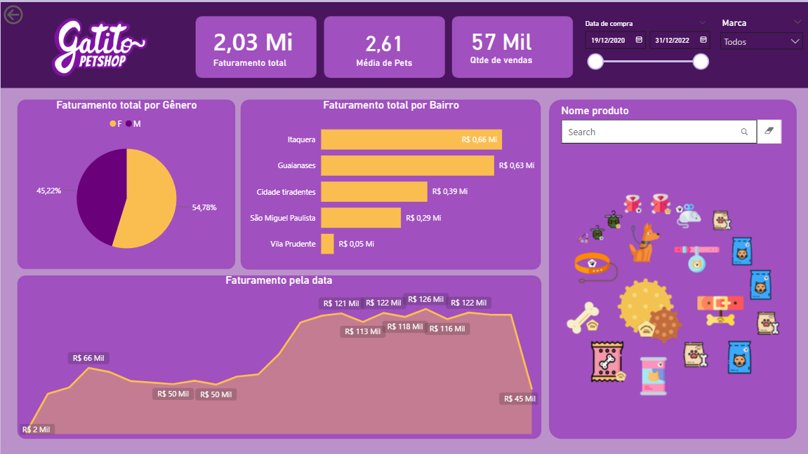

# 📊 Dashboard Power BI - Gatitos Petshop

Dashboard interativo desenvolvido em Power BI Desktop para análise de vendas e performance da Gatitos Petshop. O projeto implementa técnicas de Business Intelligence para transformar dados brutos em insights estratégicos, utilizando Power Query para tratamento de dados e DAX para cálculos personalizados.



## 🎯 Sobre o Projeto

Este projeto foi desenvolvido durante o curso **"Power BI Desktop: construindo meu primeiro dashboard"** da Alura, com foco na implementação de um processo completo de Business Intelligence para um petshop fictício.

O dashboard permite análises multidimensionais de vendas, incluindo segmentação por gênero de pets, distribuição geográfica por bairros, evolução temporal do faturamento e busca interativa de produtos.

## 🚀 Funcionalidades

- **KPIs Principais**: Faturamento total (R$ 2,03 Mi), média de pets (2,61) e quantidade de vendas (57 mil)
- **Filtros Dinâmicos**: Data de compra e marca dos produtos
- **Análise por Gênero**: Distribuição percentual do faturamento entre pets machos e fêmeas
- **Análise Geográfica**: Faturamento segmentado por bairros (Itaquera, Guaianases, Cidade Tiradentes, etc.)
- **Série Temporal**: Evolução do faturamento ao longo do período analisado
- **Busca de Produtos**: Interface visual com ícones e campo de pesquisa
- **Layout Responsivo**: Versão mobile otimizada para diferentes dispositivos

## 🛠️ Tecnologias Utilizadas

- **Power BI Desktop**: Desenvolvimento e modelagem do dashboard
- **Power Query**: Tratamento e transformação de dados
- **DAX (Data Analysis Expressions)**: Criação de medidas e colunas calculadas
- **Power BI Service**: Publicação e compartilhamento online
- **Excel**: Fonte de dados original

## 📚 Conhecimentos Aplicados

### Preparação de Dados
- Importação de dados de múltiplos formatos (CSV, Excel)
- Ajuste de decodificação para caracteres em português
- Combinação de múltiplas planilhas
- Remoção de colunas desnecessárias e linhas inválidas
- Promoção de cabeçalhos e ajuste de tipos de dados

### Modelagem de Dados
- Criação e gerenciamento de relacionamentos entre tabelas
- Resolução de problemas com dados nulos
- Criação de colunas calculadas com função `RELATED`
- Desenvolvimento de medidas explícitas com `SUM` e outras funções DAX

### Visualização
- Gráfico de pizza para análise de proporções
- Gráfico de barras horizontais para comparação entre categorias
- Gráfico de área para séries temporais
- Importação de visuais personalizados externos
- Configuração de layout mobile com ajustes de transparência e formas

### Publicação e Compartilhamento
- Diferenças entre Power BI Desktop e Power BI Service
- Publicação de relatórios na web
- Métodos seguros de compartilhamento considerando sensibilidade dos dados

## 📂 Estrutura do Projeto
```txt
dashboard-power-bi-petshop/
├── README.md
├── image.jpg # Screenshot do dashboard
├── dados/ # Arquivos de dados (se aplicável)
└── GatitosPetshop.pbix # Arquivo do Power BI Desktop
```


## 🎓 Curso Realizado

**Power BI Desktop: construindo meu primeiro dashboard** - Alura
- Instrutor: Daniel Siqueira
- Carga horária: 2 horas
- Data de conclusão: Novembro/2025

## 💡 Principais Insights

- **54,78%** do faturamento vem de pets machos
- **Itaquera** é o bairro com maior faturamento (R$ 0,66 Mi)
- Período de análise: 19/12/2020 a 31/12/2022
- Picos de faturamento chegaram a **R$ 126 Mil** em determinados períodos

## 🔍 Como Visualizar

1. Clone este repositório
2. Abra o arquivo `.pbix` no Power BI Desktop
3. Explore os diferentes visuais e filtros interativos

## 📬 Contato

Desenvolvido por João Victor Soave - [GitHub](https://github.com/jaoAprendiz)

---

⭐ Se este projeto foi útil para você, considere dar uma estrela!
